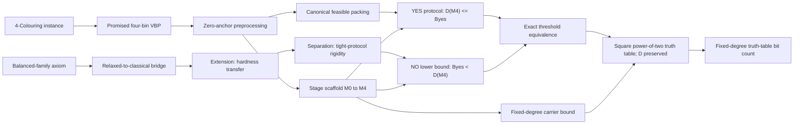

# Reviewer quick path

This page is a short route through the formal artifact. It distinguishes what
Lean proves from what a complexity-theory referee must still check outside the
kernel.

## Fifteen-minute check

1. Read `NPCC/Public.lean`. Its two conventional truth-table theorems state
   literally:

   ```text
   G.IsYes <-> D (gapTruthTable G) <= gapBudget G
   (Not G.IsYes) <-> gapBudget G + 1 <= D (gapTruthTable G)
   ```

2. Read `NPCC/Axioms.lean`. There is one project axiom, the exact
   finite-alphabet balanced-family interface used by the construction. Then
   read `docs/BALANCED-FAMILY-CITATION.md` for the AGHP/Bshouty source chain
   and parameter translation.
3. Read `PAPER-FINDINGS.md`. It lists every known paper/Lean mismatch and says
   whether the final chain is affected.
4. Run the commands in `BUILD.md`.

## One-hour mathematical check



Follow this declaration chain in the dependency explorer or source:

```text
toVBP_yes_iff + toVBP_promise
  -> zero_anchor_preprocessing
  -> scaffold_completeness                    (YES <= budget)
  -> M4_no_waste_lift + stage1_chosen_dense_threshold
  -> reduction_gap                            (NO > budget)
  -> main_np_hardness
  -> fourColorable_iff_gapMatrix_cost_le
  -> not_fourColorable_iff_gapMatrix_cost_at_least_one_more
  -> gapTruthTable_cost
  -> fourColorable_iff_gapTruthTable_cost_le
  -> not_fourColorable_iff_gapTruthTable_cost_at_least_one_more

output_size_bounds
  -> main_output_size_fixed_degree
  -> gapTruthTableBitCount_le_fixed_polynomial
```

For the lower-bound engine, read:

```text
relaxed_to_classical  ->  extension_theorem  ->  relaxed_separation
```

`extension_theorem` is the quantitative hardness transfer. The separation
theorem is the rigidity statement: a budget-tight protocol must use the
prescribed Alice prefix on every surviving, input-realizable branch.

The conceptual proof has six stages. Classical amplification produces a hard
seed; the balanced family transfers it to a succinct relaxed interlace;
Extension preserves the numerical lower bound; Separation upgrades that bound
to protocol rigidity; the scaffold stages turn rigidity into the YES/NO gap;
finally, `Padding.lean` converts the typed matrix to the ordinary square truth
table without changing `D`.

## Trust boundary

| Question | Status |
| --- | --- |
| Is the final threshold equivalence proved in both directions? | Yes, in Lean. |
| Is the NO threshold exactly one natural-number step above the YES budget? | Yes, as a lower bound `budget + 1 <= D`; not as an equality. |
| Is 4-Colouring converted to promised four-bin VBP correctly? | Yes, correctness and elementary cardinality bounds are in Lean. |
| Are the displayed `R4` and `C4` carrier bounds proved? | Yes, in Lean. |
| Is the balanced-family source chain explicit? | Yes. AGHP is binary; the exact arbitrary-alphabet interface is the sole project axiom, sourced through Bshouty's sampler, with its parameter translation documented. |
| Is the construction an executable polynomial-time map on bit strings? | No. |
| Is square power-of-two padding proved to preserve `D`? | Yes, in Lean. |
| Are fixed-degree carrier and truth-table bounds proved in `|V|+|E|+1`? | Yes, in Lean. |
| Are serialized languages and their encoding-length bridge formalized? | No. |
| Are target NP membership and source NP-hardness formalized? | No. |

The remaining human translation check is therefore concentrated: verify the
communication-complexity model and source predicates, audit the one external
balanced-family theorem against the citation note, and close the executable
encoded reduction wrapper. The internal one-bit gap and its conventional
square truth-table representation are kernel-checked.
